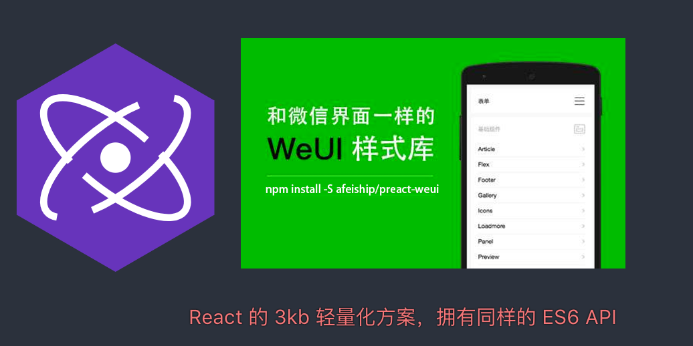

# preact-weui
> A UI library by WeChat official design team, includes the most useful widgets/modules in mobile web applications.


---

## install:
```bash
npm install --save preact-weui
```

## get started
> To use Weui Preact you must include the Weui CSS in your HTML payload:
```html
<link href="//cdn.bootcss.com/weui/1.1.2/style/weui.min.css" rel="stylesheet" type="text/css" media="screen" />
```

## usage:
+ http://localhost:8080/
+ https://preactjs.com/

## resources:

## todos:
- [ ] radio-group style fix
